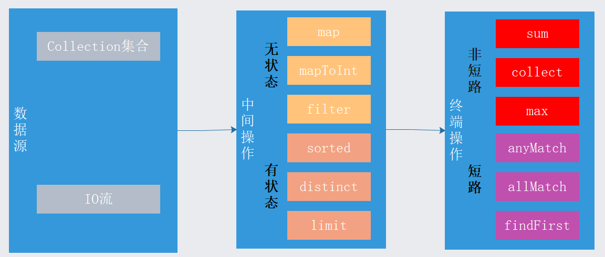

lambda的使用

##### 判空操作[#](#4afa91)

```
 //优化之前  
 if (obj != null){
 }
 //优化之后
 if (Optional.ofNullable(obj).isPresent()){
 }
```

##### 判空异常操作[#](#434a0c)

```
 //优化之前  
 if (obj == null){
    throw new .....
 }
 //优化之后
Optional.ofNullable(obj).isPresent().orElseThrow(() ->new RuntimeException(""));
```

##### 返回非空值[#](#b47511)

```
 //优化之前
 if list == null{
    return new ArrayList();
 }
 return list;
 //优化之后
 return Optional.ofNullable(list).orElse(new ArrayList<>()).get()
```

##### 求最大值最小值[#](#1113f6)

```
Integer max = Stream.of(1,2,3,4,5).max(Integer::compareTo).get();
Integer min = Stream.of(1,2,3,4,5).min(Integer::compareTo).get();
```

##### 去重操作[#](#78ad62)

```
//优化前
List<Integer> list = new ArrayList();
list.add(1);
list.add(2);
list.add(1);
Set<Integer> set = new HashSet(list);
//优化后
List<Integer> temp =list.distinct().collect(Collectors.toList());
```

##### 集合判空遍历操作[#](#9a78be)

```
//优化前
if (list == null){
    return
}
for (String s : list){
}

//优化后
Optional.ofNullable(list).orElse(new ArrayList<>()).stream().forEach()
```

##### 匿名内部类[#](#510624)

```
//优化前
new Thread(new Runnable() {
    @Override
    public void run() {
        System.out.println("Java8 ");
    }
}).start();
//优化后
new Thread(() -> System.out.println("Java8!"));
```

##### 规约计算[#](#225056)

```
//基于数据流的方式，将流装载成相应的 SummaryStatistics进行归约计算,可以实现更多的操作；
IntSummaryStatistics stats = list.stream().mapToInt(i -> i). summaryStatistics();
int max = stats.getMax();        //获取最大值
int min = stats.getMin();        //获取最小值
double sum =  stats.getSum();    //获取总值
double avg = stats.getAverage();  //获取平均值
long count = stats.getCount();     //获取总数量
```

##### 排序[#](#c360e9)

```
//升序
List<Integer> temp1 = Stream.of(2,1,3,5,0,6).sorted().collect(Collectors.toList());
//自己制定排序方式
List<Integer> temp2 = Stream.of(2,1,3,5,0,6)
.sorted((x,y) -> Integer.compare(x,y))        
.collect(Collectors.toList());
```

##### 求和[#](#fa599e)

```
//优化前
List<Integer> list  = new ArrayList();
Integer sum = 0;
for (Integer i : list){
   sum = sum + i;
}
//优化后
//方式一
sum = list.stream().mapToInt(Integer::intValue).sum();
//还有mapToDouble，mapToLong
//方式二
sum = list.stream().reduce((x,y) -> x+y);
```

##### 过滤[#](#bb8472)

```
//优化之前
List<Integer> list  = new ArrayList();
List<Integer> newList = new ArrayList();
for (Integer i : list){
    if (i % 2 ==0){
        newList.add(i);
    }
}
//优化之后
newList = list.stream().filter(i -> i % 2 ==0).collect(Collectors.toList());
```

##### 分组归类[#](#99f250)

```
//优化之前
List<Student> list= Arrays.asList(
        new Student(1,"one","zhao"),
        new Student(2,"one","qian"),
        new Student(3,"two","sun")
);
//1.1根据某个属性分组计数
Map<String,Long> map = new HashMap();
for (Student s : list){
    if(map.containsKey(s.getGroupId())){
        Long l = map.get(s.getGroupId());
        map.put(s.getGroupId(),l+1);
    }else{
        map.put(s.getGroupId(),1L);
    }
}
//优化之后
map=list.stream().collect(Collectors.groupingBy(Student::getGroupId,
Collectors.counting()));
```

##### 定义函数式方法[#](#b342dc)

```
//functionTest入参接受一个函数，这个函数入参是Integer，出参是String
public void functionTest(Function<Integer,String> apply, List<Integer> nums){
    nums.forEach(n ->{
        String result = apply.apply(n);
        System.out.println(result);
    });
}
functionTest(n ->{return String.valueOf(n);},Lists.newArrayList(1, 2, 3, 4));
```

##### 并行流计算[#](#3462b5)

```
//优化之前
List<String> list = new ArrayList();
for(String no : list){
    //下发
    down(no)
}
//优化之后,parallel是多个线程并发的，这个底层是fork-join,线程数和cpu核数相等
//这种写法应该防止因parallel的线程数耗尽，导致后面的请求的排队，从而超时，甚至雪崩，压跨服务器
list.stream().parallel().forEach(no -> down(no));
```

##### List 转换 Map,key 冲突处理[#](#52250d)

```

List<String> list12 = new ArrayList();
list12.stream().collect(Collectors.toMap(
        s -> {return s;}, //map的key
        s -> {return 1;}, //map的value
        (Integer src,Integer des) ->{ //当key冲突时，value相加
            return src+des;
        }
));

```

##### 读取文件[#](#e34255)

```
final Path path = new File( "A:\\1.txt" ).toPath();
//必须放入try with resource语法，这个流是需要的关闭的，或者try cache finally手动关闭流
try(Stream< String > lines = Files.lines(path)){
    lines.onClose(()->{ System.out.println("down");}).forEach( System.out::println);
}catch (Exception e){
}
//如果出现下面的异常，看看文件编码，指定成utf-8
//当输入字节序列对于给定 charset 来说是不合法的，或者输入字符序列不是合法的 16 位 Unicode 序列时，抛出此经过检查的异常
java.nio.charset.MalformedInputException: Input length = 1
```

##### 截取流的前 N 个元素[#](#9250c9)

```

List<String> list = Arrays.asList("hello","I","love","you");
List<String> temp = list.stream()
                          .limit(3)
                          .collect(Collectors.toList());
```

##### 跳过流的前 N 个元素[#](#0d5027)

```
List<String> list = Arrays.asList("hello","I","love","you");
List<String> temp = list.stream()
                          .skip(2)
                          .collect(Collectors.toList());
```

##### 匹配符合条件的第一个元素[#](#25f054)

```
List<String> list = Arrays.asList("hello","hello","hello","hello");
//返回配到的元素
String str = list.stream().filter( s -> {return ("hello").equals(s);}).findFirst();
```

##### 匹配任何一个则返回[#](#9ae11e)

```
List<String> list = Arrays.asList("hello","i","love","you");
//匹配到love时就返回true，否则返回返回false
boolean falg = list.stream().anyMatch(s -> s.equals("love"));
```

##### 匹配所有[#](#e593c0)

```
List<String> list = Arrays.asList("hello","hello","hello","hello");
//只有list中所有的字符串都为hello才返回true，否则返回false
boolean falg = list.stream().allMatch(s -> s.equals("hello"));
```

##### 总结一下 Stream 流的特点[#](#9432b7)

总的来说，Stream 流操作是对数据源进行一系列处理最终得到一个目标结果，数据流可以是有限的，也可以是无限的，这个处理过程整体分为两步  
**中间操作**  
这个操作返回的还是一个流，对数据经过某种操作后，再通过流进行下一个操作，就比如流水线上的加工程序，这个操作对数据的处理分别为无状态处理和有状态处理，所谓无状态就是对每一个数据都是单独处理，数据没有依赖关系，有状态操作处理时数据之间会有依赖关系，比如 max () 操作，数据之间会进行比较。  
**终端操作**  
流只能有一个终端操作，这个操作完成后，数据就已经是死数据了，得到了结果，流已经被使用完了，相当于流水线上最后一步加工完成后已经成为一个产品了，这个操作归为短路和非短路两类操作，短路操作指的流中的数据会在一个条件下终止，比如 findFirst ()，在所有数据中匹配到第一个符合条件的数据就终止，而非短路操作时所有数据都会遍历，比如 sum ()，所有数据累加成为最后结果

[](https://cdn.learnku.com/uploads/images/201912/23/47180/jFxUT3M7ZL.png!large)

**Stream 的一些特性**

1.  无存储
2.  函数式编程，能够减少大量代码
3.  延迟执行，也叫做惰性执行
4.  可消费（只会被消费一次）
5.  可读性好（但刚刚入门可能难以理解）

[](https://cdn.learnku.com/uploads/images/201912/23/47180/y5EGmEFqw7.jpg!large)

> 本作品采用[《CC 协议》](https://learnku.com/docs/guide/cc4.0/6589)，转载必须注明作者和本文链接

那小子阿伟