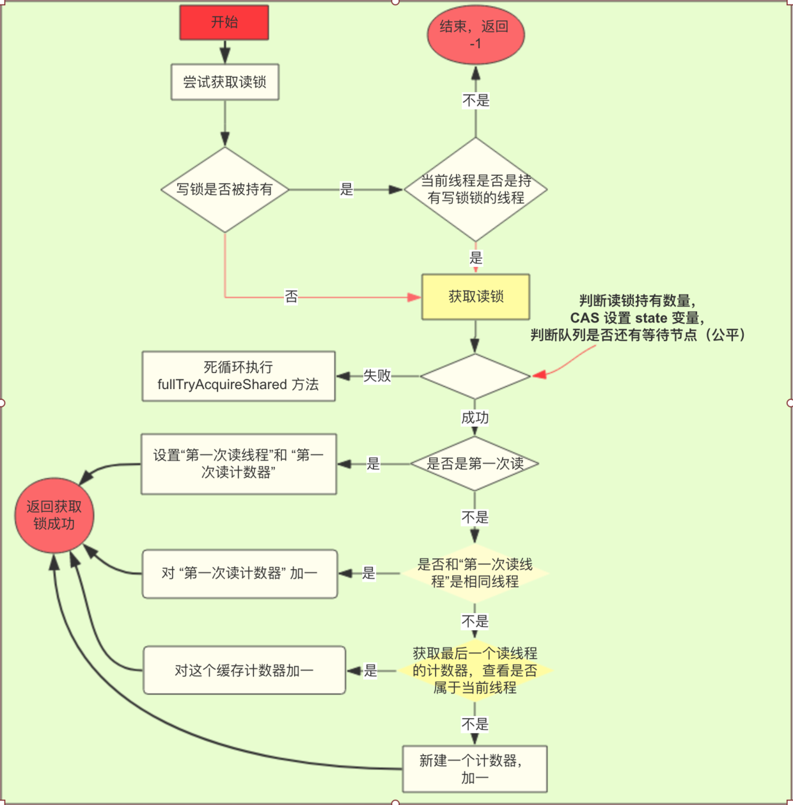
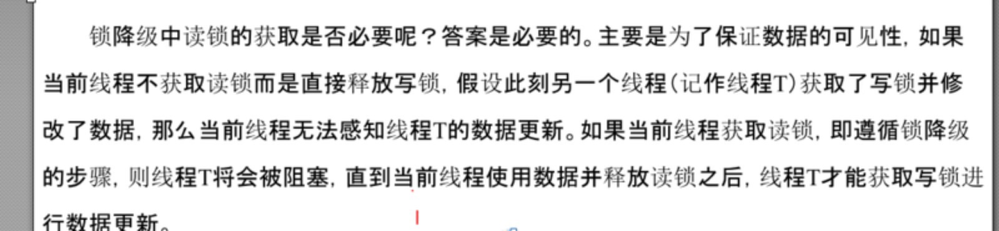
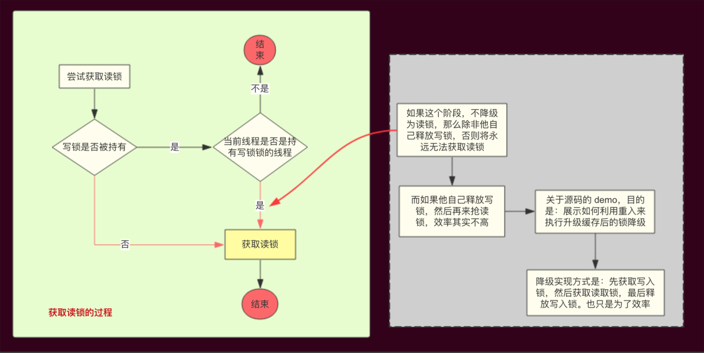

并发编程之——读锁源码分析(解释关于锁降级的争议) - 莫那-鲁道 - 博客园

## 1\. 前言

在前面的文章 [并发编程之——写锁源码分析](http://thinkinjava.cn/article/106)中，我们分析了 1.8 JUC 中读写锁中的**写锁的获取和释放过程**，今天来分析一下读锁的获取和释放过程，读锁相比较写锁要稍微复杂一点，其中还有一点有争议的地方——锁降级。

今天就来解开迷雾。

首先说明，获取读锁的过程是获取共享锁的过程。

代码加注释如下：

```
protected final int11 tryAcquireShared(int unused) {

    Thread current = Thread.currentThread();
    int c = getState();
    
    
    
    
    if (exclusiveCount(c) != 0 && getExclusiveOwnerThread() != current)
        
        return -1;
    
    int r = sharedCount(c);
    
    
    if (!readerShouldBlock() && r < 65535 && compareAndSetState(c, c + 65536)) {
        
        if (r == 0) {
            
            firstReader = current;
            
            firstReaderHoldCount = 1;

        }
         else if (firstReader == current) {
            
            firstReaderHoldCount++;
        } else {
            
            HoldCounter rh = cachedHoldCounter;
            
            if (rh == null || rh.tid != getThreadId(current))
                
                cachedHoldCounter = rh = readHolds.get();
            
            else if (rh.count == 0)
                readHolds.set(rh);
            
            rh.count++;
        }
        return 1;
    }
    
    return fullTryAcquireShared(current);
}

```

总结一下上面代码的逻辑吧！

1.  判断写锁是否空闲。
2.  如果不是空闲，且当前线程不是持有写锁的线程，则返回 -1 ，表示抢锁失败。如果是空闲的，进入第三步。如果是当前线程，进入第三步。
3.  判断持有读锁的数量是否超过 65535，然后使用 CAS 设置 int 高 16 位的值，也就是加一。
4.  如果设置成功，且是第一次获取读锁，就设置 firstReader 相关的属性（为了性能提升）。
5.  如果不是第一次，当当前线程就是第一次获取读锁的线程，对 “第一次获取读锁线程计数器” 加 1.
6.  如果都不是，则获取最后一个读锁的线程计数器，判断这个计数器是不是当前线程的。如果是，加一，如果不是，自己创建一个新计数器，并更新 “最后读取的线程计数器”（也是为了性能考虑）。最后加一。返回成功。
7.  如果上面的判断失败了（CAS 设置失败，或者队列有等待的线程（公平情况下））。就调用 fullTryAcquireShared 方法死循环执行上面的步骤。

步骤还是有点多哈，画个图吧，更清晰一点。



其实，上面的逻辑里，是有锁降级的逻辑在里面的。但我们等会放在后面说。

先看看 `fullTryAcquireShared` 方法，其实这个方法和 `tryAcquireShared` 高度类似。代码加注释如下：

```
final int fullTryAcquireShared(Thread current) {
    
    HoldCounter rh = null;
    
    for (;;) {
        int c = getState();
        
        if (exclusiveCount(c) != 0) {
            
            
            if (getExclusiveOwnerThread() != current)
                return -1;
        
        } else if (readerShouldBlock()) {
            
            if (firstReader == current) {
            
            } else {
                if (rh == null) {
                    rh = cachedHoldCounter;
                    if (rh == null || rh.tid != getThreadId(current)) {
                        
                        rh = readHolds.get();
                        if (rh.count == 0)
                            readHolds.remove();
                    }
                }
                if (rh.count == 0)
                    return -1;
            }
        }
        
        if (sharedCount(c) == MAX_COUNT)
            throw new Error("Maximum lock count exceeded");
        
        if (compareAndSetState(c, c + SHARED_UNIT)) {
            
            if (sharedCount(c) == 0) {
                
                firstReader = current;
                
                firstReaderHoldCount = 1;
            
            } else if (firstReader == current) {
                firstReaderHoldCount++;
            } else {
                if (rh == null)
                    rh = cachedHoldCounter;
                if (rh == null || rh.tid != getThreadId(current))
                    
                    rh = readHolds.get();
                else if (rh.count == 0)
                    readHolds.set(rh);
                
                rh.count++;
                
                cachedHoldCounter = rh; 
            }
            return 1;
        }
    }
}

```

这两个方法其实高度相似的。就不再解释了。

到这里，其实留下了几个问题：一个是 `firstReader` 和 `firstReaderHoldCount` 的作用，还有就是 `cachedHoldCounter` 的作用。最后是锁降级。

解释一下：

- `firstReader` 是获取读锁的第一个线程。如果只有一个线程获取读锁，很明显，使用这样一个变量速度更快。  
     \* `firstReaderHoldCount` 是 `firstReader`的计数器。同上。
- `cachedHoldCounter`是最后一个获取到读锁的线程计数器，每当有新的线程获取到读锁，这个变量都会更新。这个变量的目的是：当最后一个获取读锁的线程重复获取读锁，或者释放读锁，就会直接使用这个变量，速度更快，相当于缓存。

关于锁降级，重点解释一下，毕竟是我们的标题。

## 3\. 锁降级的争议

首先，什么是锁降级？在读锁的哪个地方体现？

回答第一个问题，引自 JDK 的解释：

> 锁降级:  
> 重入还允许从写入锁降级为读取锁，其实现方式是：先获取写入锁，然后获取读取锁，最后释放写入锁。但是，从读取锁升级到写入锁是不可能的。

体现在读锁哪里？

在 tryAcquireShared 方法和 fullTryAcquireShared 中都有体现，例如下面的判断：

```
if (exclusiveCount(c) != 0) {
    if (getExclusiveOwnerThread() != current)
        return -1;

```

上面的代码的意思是：当写锁被持有时，如果持有该锁的线程不是当前线程，就返回 “获取锁失败”，反之就会继续获取读锁。称之为锁降级。

在很多书和文章中，对锁降级都会有类似下面的解释：



上面提到，锁降级中，读锁的获取的目的是 “为了保证数据的可见性”。而得到这个结论的依据是 “如果当前线程不获取读锁而是直接释放写锁，假设此刻另一个线程（记作线程 T）获取了写锁并修改了数据，那么当前线程无法感知线程 T 的数据更新”。

这里貌似有个漏洞：如果另一个线程获取了写锁（并修改了数据），那么这个锁就被独占了，没有任何其他线程可以读到数据，更不用谈 “感知数据更新”。

楼主认为，锁降级说白了就是写锁的一种特殊重入机制。通过这种重入，可以减少一步流程——释放写锁后 再次 获取读锁。

使用了锁降级，就可以减去**释放写锁**的步骤。直接获取读锁。效率更高。而且没有线程争用。和 “可见性” 并没有关系。

用一幅图来展示锁降级：



总的来说，锁降级就是一种特殊的锁重入机制，JDK 使用 `先获取写入锁，然后获取读取锁，最后释放写入锁` 这个步骤，是为了提高获取锁的效率，而不是所谓的可见性。

最后再总结一下获取锁的逻辑，首先判断写锁释放被持有了，如果被持有了，且是当前线程，使用锁降级，如果没有，读锁正常获取。

获取过程中，会使用 firstReader 和 cachedHoldCounter 提高性能。

代码加注释如下：

```

protected final boolean tryReleaseShared(int unused) {
    Thread current = Thread.currentThread();
    
    if (firstReader == current) {
        
        if (firstReaderHoldCount == 1)
            firstReader = null;
        
        else
            firstReaderHoldCount--;
    } else {
        HoldCounter rh = cachedHoldCounter;
        
        if (rh == null || rh.tid != getThreadId(current))
            
            rh = readHolds.get();
        int count = rh.count;
        
        if (count <= 1) {
            readHolds.remove();
            
            if (count <= 0)
                throw unmatchedUnlockException();
        }
        
        --rh.count;
    }
    for (;;) {
        int c = getState();
        
        int nextc = c - SHARED_UNIT;
        
        if (compareAndSetState(c, nextc))
            
            return nextc == 0;
    }
}

```

释放还是很简单的，步骤如下：

1.  如果当前线程是第一个持有读锁的线程，则只需要操作 firstReaderHoldCount 减一。如果不是，进入第二步。
2.  获取到缓存计数器（最后一个线程的计数器），如果匹配到当前线程，就减一。如果不匹配，进入第三步。
3.  获取当前线程自己的计数器（由于每个线程都会多次获取到锁，所以，每个线程必须保存自己的计数器。）。
4.  做减一操作。
5.  死循环修改 state 变量。

## 5\. 总结

“读写锁没有想象中简单” 是此次阅读源码的最大感慨。事实上，花的最多时间是锁降级，因为对这块的不理解，参照了一些书籍和博客，但还是云里雾里，我也不敢确定我说的就是全对的，但我敢说，我写的是经过我思考的。

总结下读锁的获取逻辑。

读锁本质上是个共享锁。

但读锁对锁的获取做了很多优化，比如使用 firstReader 和 cachedHoldCounter 最第一个读锁线程和最后一个读锁线程做优化，优化点主要在释放的时候对计数器的获取。

同时，如果在获取读锁的过程中写锁被持有了，JUC 并没有让所有线程痴痴的等待，而是判断入如果获取读锁的线程是正巧是持有写锁的线程，那么当前线程就可以降级获取写锁，否则就会死锁了（**为什么死锁，当持有写锁的线程想获取读锁，但却无法降级，进入了等待队列，肯定会死锁**）。

还有一点就是性能上的优化，如果先释放写锁，再获取读锁，势必引起锁的争抢和线程上下文切换，影响性能。

还有一个就是，读书的时候，要有怀疑精神，一定要思考，而不是顺着他的思路去看书，诚然，书中大部分时候都是正确的，但我们贪婪的希望，那错误的一小部分尽量不要影响到我们。