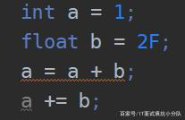
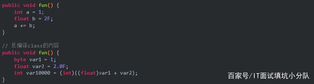
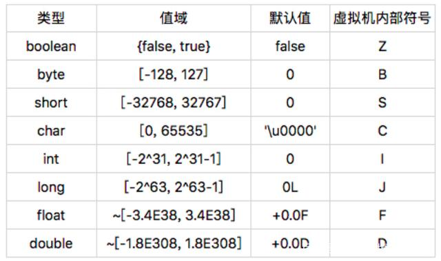
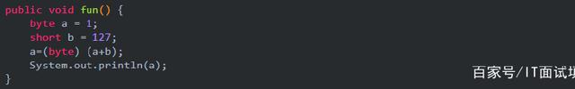
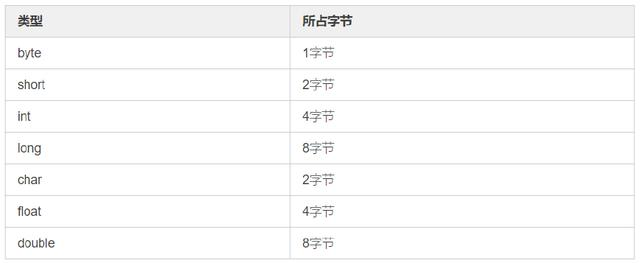

强制类型转换a=a+b和a+=b的区别

小A：a=a+b和a+=b。这两者有什么区别呀？没看出来有什么区别啊！

MDove：你所说的没区别，是这样吧？

MDove：那你有没有换过别的写法呢？比如把b的类型变一下：

float b = 2F;

MDove：怎么样，看出来效果了吧。没看出来？？OK，那我就贴上效果：

MDove：这样就能看明白了吧？b提升了类型之后。会发现a = a + b是没办法编译通过的，需要强制类型转换才可以。但是我们的a + = b却可以，这是为什么呢？其实很简单。让我们反编译一下这个class文件，就可以很清晰的给出答案：

MDove：所以它们二者的区别就很清楚了吧？在这种a比b类型范围要小的情况下。

a = a + b;需要强制类型转换，也就是我们常写的：a = (int) (a+b);而我们的a += b;

被我们的编译器在编译期做了一些小手脚。也就是编译器帮我们进行了强制类型转化。

小A：原来是这样，那强制类型转换会带来什么问题呢？

MDove：解答这个问题，让我们先来看一张图：

MDove：强制类型转化，一般会带来精度丢失的问题。这里float的范围太大，我们就用byte和short来演示，强制类型带来的问题：

MDove：System打出的内容，应该知道是什么吧？没错是-128。强制类型带来的问题一目了然了吧。

小A：怎么会是-128呢？

MDove：OK，接下来，我来解释一下，为什么会是-128这么一个奇怪的数字。首先，我们都知道基本类型在堆中所占的字节如下表。

小A：不对呀？我记得基本类型是存放在栈中的呀？

MDove：这种说法并不错，但不全面。存放在堆中还是在栈中，是取决于这个变量声明的位置。如果是局部变量，则会存放在栈帧中。但是如果是成员变量（全局变量），那么就会存放在堆中。此外存放在栈中，基本类型所占的字节是固定：如果是32位计算机那么就是4字节；64位便是8字节。

MDove：解释完所占字节的问题，咱们继续。由上边可知byte占1字节，那么也就是8位，如果每一位都为1（11111111），那么理论上就是它所能表示的最大内容。

小A：那应该是255呀！

MDove：实际不然，因为正负的原因，计算机中使用补码的形式表示二进制，高1位表示符号位（0为正，1为负）。因此对于8位来说，最大只能是01111111，也就是127。（0表示它为正）

MDove：而我们刚才的那个计算byte a = 1; short b = 127; a=(byte) (a+b);不考虑类型转换，那么a+b妥妥的等于128。并且对于所占2字节的short来说那就是00000000 10000000。但是我们强制类型转化成了byte，这时做了一件事情，那就是高1字节的内容全部砍掉，也就是只剩下了10000000。

MDove：按我们刚才所说，高1位的内容表示正负。1为负。

小A：！！！如果1为负，那System.out应该是0才对啊。

MDove：一看你二进制就没有好好学。对于含有补码形式的10000000，我们要用补码的方式去计算。计算套路如下：高1位为1，那么这是数就是负数。想要知道是负几，我们需要将10000000按位取反，也就是01111111。还没完，此时还要再加1，也就是10000000。现在得到的这个数是几，那么就是负几，10000000是十进制的128，因此补码形式的10000000也就是：-128。

MDove：这样解释是不是就知道强制类型转换带来的问题，以及为什么强制类型转化后的byte变成了-128了吧。

小A：好难学...我想回家种地...

小A妈：崽，别学编程啦，赶紧回家收玉米了。

剧终